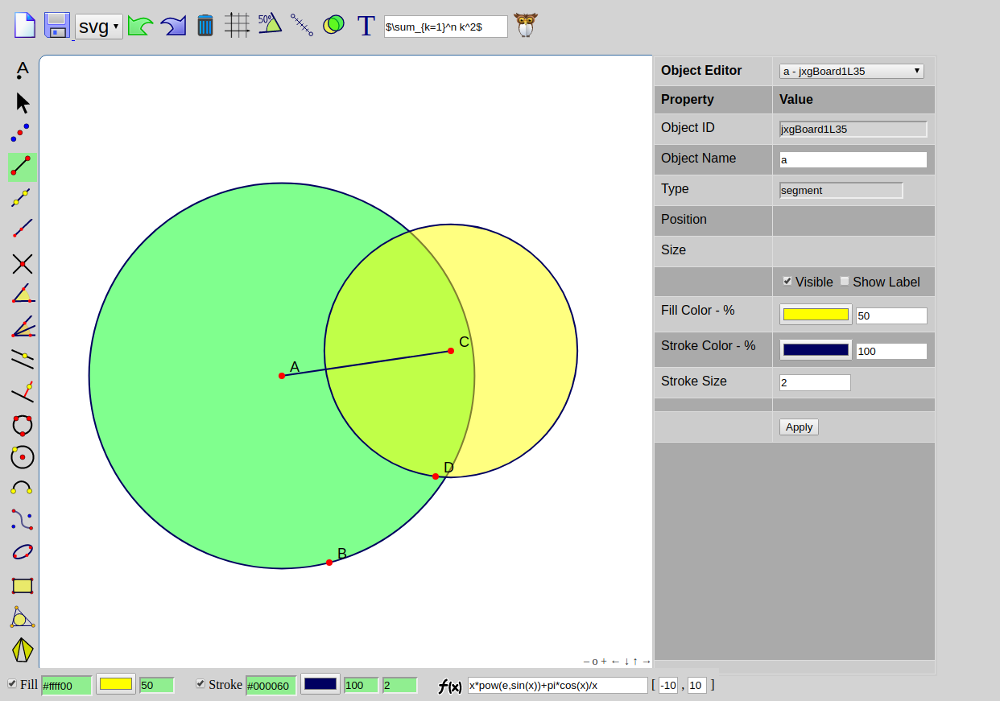
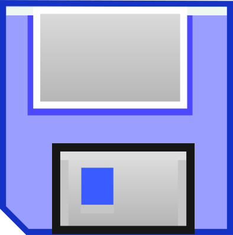

## Welcome to Geometria

**Geometria is a tool for interactive Geometry. Its purpose is to ease Geometric constructions, to save them in a programmable configurable way and reveal and challenge a new programmer in order to explore further. The philoshophy followed behind any geometric construction is an infinite loop where at each step we introduce some points and then we select them in order to apply the desirable geometric tool. "Geometria" was designed with simplicity and minimalism in mind.**

Top Panel Tools                      | 
----------------------------------------- | ------------------------------------------------------------------------------
           | Select the file extesion you would like to save your construction. Then press save in order to download your construction as a file of the selected type.
----------------------------------------- | ------------------------------------------------------------------------------
           | Select the file extesion you would like to save your construction. Then press save in order to download your construction as a file of the selected type.

